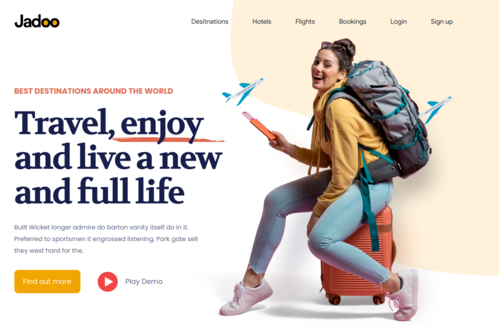

# Макет сайта о путешествиях "Jadoo"
## Базовое описание
Landing page-страница с интерактивными элементами.

## Особенности:
- Адаптивная вёрстка;
<GIF>
- Добавлены интерактивные элементы, активируемые при скролле; 
О решении задачи нахождения координатов я писал в статье. 
<code>
    <video autoplay="autoplay" loop="loop">
        <source src="./readme_src/plane.mov" type='video/quicktime; codecs="avc1.42E01E"'>
    </video>
</code>
- Реализовано выпадающее меню; 
<code>
    
</code>

- Слайдер с отзывами (DOM-структура зависит от ширины экрана) 
<code>
    
</code>

_Если вы тестируете адаптивное отображение интерфеса, обращаю внимание, что в блоке сайта **"What People Say About Us"** используется код JS для изменения DOM-дерева в зависимости от ширины экрана устройства. **Для корректного оторажения страницы обновите её.** Разумеется, при обычном пользовании страницей, всё работает корректно изначально._

## Используемые инструменты:
- JavaScript;
- Webpack;

## Автор 
Разработано: [Андрей Корнеев](https://github.com/andrey-kor)  

---
Учебное приложение