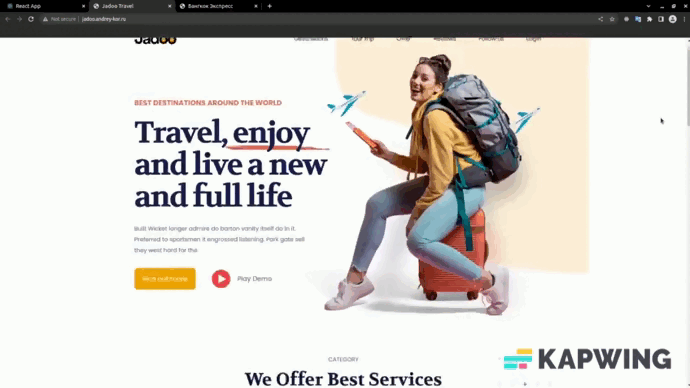

# Макет сайта о путешествиях "Jadoo"
## Базовое описание
Адаптивный лендинг с анимированными элементами. Код написан на JS.

  

 

## Возможности:
- Валидация e-mail;
- Слайдер с отзывами;
- Выпадающее меню;
- Адаптивная вёрстка;
- Анимированные элементы при скролле (при ширине экрана от 600px до 1060px);

## Используемые инструменты:
- HTML
- CSS;
- JavaScript.